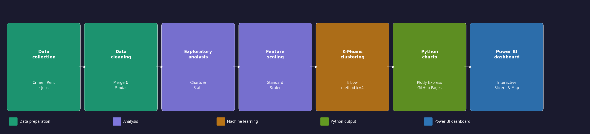
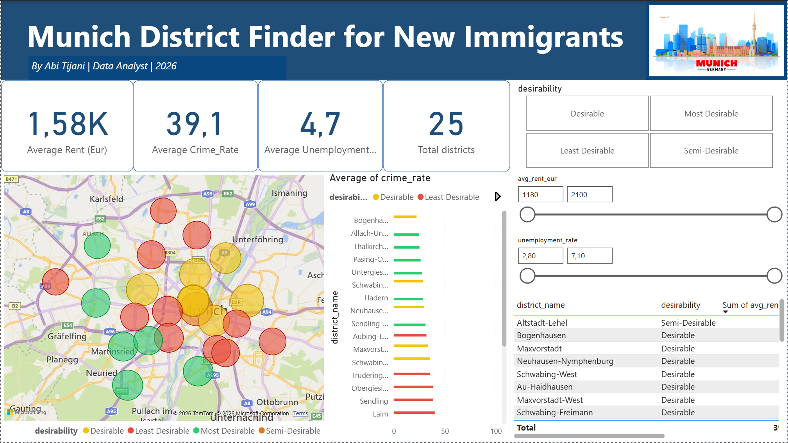

# Analysis of Munich Neighbourhoods for New Immigrants Using Machine Learning

This is a repository for the Analysis of Munich Neighbourhoods for New Immigrants Using Machine Learning. All analysis was done by **Abi Tijani**.

The datasets, Google Colab notebooks, Power BI dashboard and interactive charts used in the project are included in this repository.

See link to **blog post** for a more concise report - [Medium Article](https://medium.com/@abixdata/analysis-of-munich-neighbourhoods-for-new-immigrants-using-machine-learning-23a732b05981) *(Towards Data Science - coming soon)*

---

## Introduction

I moved to Germany in January 2026 as a new immigrant. After four months of searching for opportunities in a small city with limited prospects, I made a decision to move to another city. But before packing my bags, I did what any data analyst would do. I built an analysis that helped me make a data-driven decision to move to Munich.

Munich has 25 Stadtbezirke (districts) and they are not all equal. As a new immigrant, a vital question to answer is **"What district do I settle in?"**

The aim of this project is to group Munich's 25 districts in order of desirability for new immigrants using Machine Learning and Data Visualisation techniques, and to present the findings through an interactive Power BI dashboard. I performed my analysis using the following criteria:

- **Primary Benchmarks:** Unemployment rate and Crime rate per district
- **Secondary Benchmark:** Average monthly rent for a 1-bedroom apartment per district (EUR/month)

---

## Methodology

### Python Libraries

- **Pandas** - For storing, cleaning and manipulating the district data
- **NumPy** - For numerical operations and array handling
- **GeoPandas** - For storing spatial data coordinates using gpd.points_from_xy()
- **Scikit-learn** - For StandardScaler (feature scaling) and KMeans (K-Means clustering)
- **Plotly Express** - For all interactive charts hosted on GitHub Pages
- **Matplotlib** - For early exploratory bar charts during the data analysis phase

### Project Flowchart

---

## Phase 1 - Python Analysis and Interactive Charts

All interactive charts are hosted on GitHub Pages:

| Chart | Link |
|---|---|
| Unemployment Rate by District | [View](https://abixdata.github.io/munich-neighbourhood-analysis/Interactive_Charts/chart1_unemployment.html) |
| Average Rent by District | [View](https://abixdata.github.io/munich-neighbourhood-analysis/Interactive_Charts/chart2_rent.html) |
| Crime vs Unemployment Bubble Chart | [View](https://abixdata.github.io/munich-neighbourhood-analysis/Interactive_Charts/chart3_bubble.html) |
| Elbow Method | [View](https://abixdata.github.io/munich-neighbourhood-analysis/Interactive_Charts/chart4_elbow.html) |
| Desirability Index | [View](https://abixdata.github.io/munich-neighbourhood-analysis/Interactive_Charts/chart5_desirability.html) |
| Munich District Map | [View](https://abixdata.github.io/munich-neighbourhood-analysis/Interactive_Charts/chart6_map.html) |

---

## Phase 2 - Power BI Dashboard

The findings from the Python analysis were built into a fully interactive Power BI dashboard where any new immigrant can filter by their budget and priorities to instantly find their best Munich district.

- [Download Power BI file (.pbix)](https://github.com/AbiXData/munich-neighbourhood-analysis/blob/main/Munich_District_Finder.pbix)
- [View PDF snapshot](https://github.com/AbiXData/munich-neighbourhood-analysis/blob/main/Munich_District_Finder_260614_152938.pdf)

---

## View Full Notebook

[Open notebook on GitHub](https://github.com/AbiXData/munich-neighbourhood-analysis/blob/main/Analysis_of_Munich_Neighbourhoods_using_ML_Full_.ipynb)

---

## About

Analysis of Munich Neighbourhoods for New Immigrants Using Machine Learning - by Abi Tijani, 2026

[LinkedIn](https://www.linkedin.com/in/abitijani/) | [GitHub](https://github.com/AbiXData)

### Topics
`python` `data-analytics` `machine-learning` `k-means` `munich` `germany` `plotly-express` `power-bi` `data-visualisation` `geopandas` `scikit-learn` `new-immigrants` `kmeans-clustering` `pandas` `numpy`
