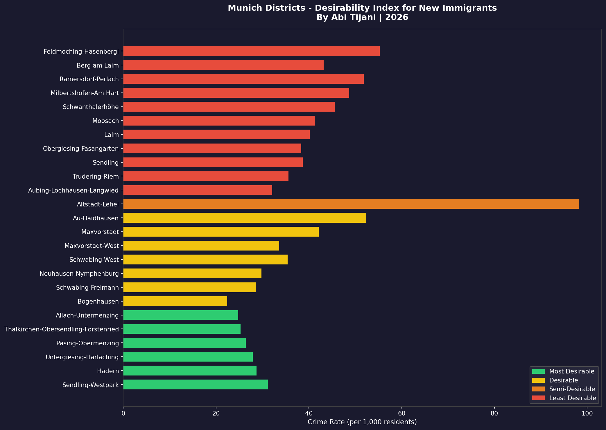

# Analysis of Munich Neighbourhoods for New Immigrants Using Machine Learning

I moved to Germany in January 2026 as a new immigrant. After four months of searching for opportunities in a small city with limited prospects, I made a decision to move to another city. But before packing my bags, I did what any data analyst would do. I built an analysis that helped me make a data-driven decision to move to Munich.

Read the full article on [Medium](https://medium.com/@abixdata/analysis-of-munich-neighbourhoods-for-new-immigrants-using-machine-learning-23a732b05981)

---

## What?

An end-to-end data analytics and Machine Learning project that analyses Munich's 25 Stadtbezirke (districts) and ranks them in order of desirability for new immigrants, using crime rates, unemployment rates and average rent as key indicators. The project includes Python analysis, K-Means clustering, interactive Plotly Express charts and a Power BI dashboard.

---

## Why?

As a new immigrant in Munich with no local network and no prior knowledge of the city, I needed a data-driven way to decide where to settle. Instead of guessing, I collected real data from official German sources and used Machine Learning to find the answer. This project was built to solve a real personal problem and to demonstrate end-to-end data analytics skills.

---

## Who?

- New immigrants and expats moving to Munich who want a data-driven guide to choosing a district
- HR and relocation teams helping international hires settle in Munich
- Data analysts and data science enthusiasts interested in real-world Machine Learning applications
- Anyone making a decision about where to live in Munich based on safety, employment and affordability

---

## So What?

The analysis produced a Munich District Desirability Index ranking all 25 districts into four categories: Most Desirable, Desirable, Semi-Desirable and Least Desirable. A fully interactive Power BI dashboard was then built so that anyone moving to Munich can filter districts by their own budget and priorities and instantly see their best options.

The key finding: only 24% of Munich's districts fall into the Most Desirable category. For new immigrants, the best value districts are Sendling-Westpark, Hadern and Pasing-Obermenzing - low crime, affordable rent and decent employment rates.

---

## Power BI Dashboard

**Download the full interactive dashboard:**
[Munich_District_Finder.pbix](Munich_District_Finder.pbix) - Open in Power BI Desktop to interact with all filters and slicers

**View PDF version:**
[Munich_District_Finder_For_New_Immigrants.pdf](Munich_District_Finder_For_New_Immigrants.pdf)

**Dashboard features:**
- KPI cards showing average rent, crime rate, unemployment and total districts
- Interactive bubble map of all 25 Munich districts colour coded by desirability
- Bar chart showing crime rate per district sorted by desirability
- Desirability slicer - filter by Most Desirable, Desirable, Semi-Desirable, Least Desirable
- Rent range slider - filter by maximum monthly budget
- Unemployment range slider - filter by employment level
- Data table showing all districts with their desirability category

---

## Problem Statement

Munich has 25 Stadtbezirke (districts) and they are not all equal. As a new immigrant, a vital question to answer is "What district do I settle in?"

The aim of this project is to group Munich's 25 districts in order of desirability for new immigrants using Machine Learning and Data Visualisation techniques. I performed my analysis using the following criteria:

- **Primary Benchmarks:** Unemployment rate and Crime rate per district
- **Secondary Benchmark:** Average monthly rent for a 1-bedroom apartment per district (EUR/month)

---

## Methodology

### Python Libraries

- **Pandas** - Used for storing, cleaning and manipulating the district data. All three datasets were loaded into Pandas dataframes and merged into one final dataframe for analysis
- **NumPy** - Used for numerical operations and array handling throughout the analysis
- **GeoPandas** - Used to create a GeoDataFrame with point coordinates for all 25 Munich districts using gpd.points_from_xy()
- **Scikit-learn** - Used for two key Machine Learning tasks: StandardScaler to normalise the data before clustering, and KMeans to apply K-Means clustering with k=4
- **Plotly Express** - Used to build all interactive charts and the district map. Charts were saved as HTML files and hosted on GitHub Pages
- **Matplotlib** - Used for early exploratory bar charts during the data analysis phase
- **Power BI** - Used to build the final interactive dashboard with slicers, KPI cards, map and data table

### Project Flowchart

---

## Interactive Charts

All charts are fully interactive - hosted on GitHub Pages:

| Chart | Link |
|---|---|
| Unemployment Rate by District | [View](https://abixdata.github.io/munich-neighbourhood-analysis/Interactive_Charts/chart1_unemployment.html) |
| Average Rent by District | [View](https://abixdata.github.io/munich-neighbourhood-analysis/Interactive_Charts/chart2_rent.html) |
| Crime vs Unemployment Bubble Chart | [View](https://abixdata.github.io/munich-neighbourhood-analysis/Interactive_Charts/chart3_bubble.html) |
| Elbow Method | [View](https://abixdata.github.io/munich-neighbourhood-analysis/Interactive_Charts/chart4_elbow.html) |
| Desirability Index | [View](https://abixdata.github.io/munich-neighbourhood-analysis/Interactive_Charts/chart5_desirability.html) |
| Munich District Map | [View](https://abixdata.github.io/munich-neighbourhood-analysis/Interactive_Charts/chart6_map.html) |

---

## View Full Notebook

👉 [Open notebook on GitHub](https://github.com/AbiXData/munich-neighbourhood-analysis/blob/main/Analysis_of_Munich_Neighbourhoods_using_ML_Full_.ipynb)

---

## Final Results

K-Means clustering (k=4) was used to group all 25 Munich districts to produce a final Munich District Desirability Index.

View the fully interactive version: [Click here](https://abixdata.github.io/munich-neighbourhood-analysis/Interactive_Charts/chart5_desirability.html)

[View Interactive Munich District Map](https://abixdata.github.io/munich-neighbourhood-analysis/Interactive_Charts/chart6_map.html)

---

## About

Analysis of Munich Neighbourhoods for New Immigrants Using Machine Learning - by Abi Tijani, 2026

[LinkedIn](https://www.linkedin.com/in/abitijani/) | [GitHub](https://github.com/AbiXData) | [Medium](https://medium.com/@abixdata/analysis-of-munich-neighbourhoods-for-new-immigrants-using-machine-learning-23a732b05981)

### Topics
`python` `data-analytics` `machine-learning` `k-means` `munich` `germany` `plotly-express` `data-visualisation` `geopandas` `scikit-learn` `new-immigrants` `kmeans-clustering` `pandas` `numpy` `power-bi` `dashboard`
